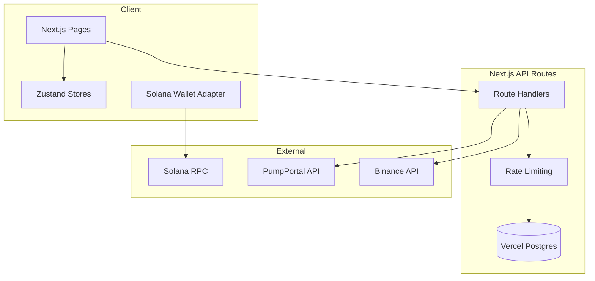

# meme.pro - AI Agent Documentation (v2.1)

> **Purpose**: Single source of truth for all AI agents working on meme.pro. Details architecture, features, design system, and patterns.

---

## 1. Project DNA & Visual Identity

**Core Aesthetic**: "Stream" / "Cyber-Sport" / "Premium Dark"

### Design System (globals.css)

| Token | Value | Usage |
|-------|-------|-------|
| `--space-1` to `--space-12` | 4px to 48px | Spacing scale |
| `--text-xs` to `--text-3xl` | 11px to 30px | Typography |
| `--radius-sm/md/lg/xl` | 4px to 12px | Border radius |
| `--transition-fast/base/slow` | 150ms to 300ms | Animations |
| `--shadow-sm/md/lg` | Layered | Elevation |

### Colors
- **Background**: `#000000`, `#050505`, `#0a0a0a`
- **Border**: `#1a1a1a`, `#222222`
- **Accent**: Emerald (`#10b981`), Gold (`#f59e0b`), Ruby (`#ef4444`)

### Component Classes
- `.btn-primary`, `.btn-secondary` - Button styles
- `.card`, `.card-interactive` - Card containers
- `.input` - Form inputs
- `.badge`, `.badge-success/warning/danger` - Status indicators
- `.glass`, `.glass-card` - Glassmorphism effects

---

## 2. Platform Architecture



---

## 3. Directory Map

- `src/app/` - Next.js pages
  - `page.tsx`: Stream (main dashboard)
  - `p2p/`: P2P casino (Puntbit)
  - `perpetuals/`: Crypto futures
  - `research/`: Research tab (external)
  - `api/`: Server-side logic

- `src/components/` - UI components
  - `p2p/`: Game-specific UI
  - Core components: TokenCard, TokenColumn, Header, Navigation

- `src/lib/` - Core utilities
  - `db.ts`: Database connection
  - `p2p/`: Game mechanics, payment service
  - `utils/`: Formatters, rate limiting

---

## 4. Security Features

### Rate Limiting (`src/lib/utils/rateLimit.ts`)
All payment APIs are rate limited:
- **Deposits**: 5 requests/minute per IP
- **Payouts/Refunds**: 10 requests/minute per IP
- **General**: 30 requests/minute per IP

### Duplicate Protection
- **Double Payout Prevention**: Checks `payment_transactions` before processing
- **Duplicate Deposit**: Prevents same player depositing twice for same lobby
- **Duplicate Refund**: Prevents re-issuing refunds

### Transaction Verification
- On-chain verification of deposit transactions
- Sender address validation
- Amount tolerance: 5000 lamports (~$0.001)

---

## 5. Feature: Stream (Home)

**URL**: `/`

Real-time three-column feed of Solana token activity.

### Mechanisms
- **Columns**: "New Pairs", "Final Stretch", "Migrated"
- **Data Source**: `/api/tokens` (proxies PumpPortal)
- **Live Indicators**: Pulsing green dot on "New Pairs"
- **Search**: Per-column filtering by name/symbol
- **Keyboard**: j/k navigation, Enter to select
- **Hot Tokens**: >5000% change highlighted purple

---

## 6. Feature: P2P Casino

**URL**: `/p2p`

Peer-to-peer crypto casino with 2% platform fee.

### Available Games
| Game | Odds | Payout | Status |
|------|------|--------|--------|
| Coinflip | 50/50 | 1.96x | Active |
| Dice | Variable | Dynamic | Removed |

### Payment Flow
1. Create lobby → deposit to escrow
2. Opponent joins → matches deposit
3. Game resolves → winner paid (pot - 2%)
4. Loser gets nothing, platform keeps fee

### Provably Fair
- Server seed hash shown before game
- Result = SHA-256(serverSeed:clientSeed:nonce)
- Full verification UI available

---

## 7. Feature: Perpetuals Feed

**URL**: `/perpetuals`

Professional crypto data dashboard.

- **Assets**: BTC, ETH, SOL, XRP, DOGE
- **Data**: `/api/market` (proxies Binance)
- **Charts**: TradingView lightweight-charts

---

## 8. API Reference

### Payment APIs (Rate Limited)
| Endpoint | Method | Purpose |
|----------|--------|---------|
| `/api/p2p/payment/verify-deposit` | POST | Verify player deposit |
| `/api/p2p/payment/payout` | POST | Process winner payout |
| `/api/p2p/payment/refund` | POST | Refund cancelled game |
| `/api/p2p/payment/status` | GET | Check payment status |

### Data APIs
| Endpoint | Method | Purpose |
|----------|--------|---------|
| `/api/tokens` | GET | Token stream data |
| `/api/market` | GET | Binance market data |
| `/api/price` | GET | SOL price |

---

## 9. Agent Guidelines

1. **Use Design System**: All UI must use CSS variables from globals.css
2. **Strict Types**: No `any` - define interfaces in `src/lib/types.ts`
3. **Clean Code**: No verbose comments, production-ready patterns
4. **Error Handling**: User-friendly messages, proper logging
5. **Rate Limiting**: All new APIs must include rate limiting

---

## 10. Environment Variables

### Required (Production)
```
ESCROW_SECRET_KEY=<base64-encoded-keypair>
NEXT_PUBLIC_ESCROW_WALLET=<escrow-public-key>
POSTGRES_URL=<vercel-postgres-url>
```

### Optional
```
SOLANA_RPC_ENDPOINT=<premium-rpc-url>
NEXT_PUBLIC_SOLANA_NETWORK=mainnet-beta
```

---

*Documentation maintained by AI Agent System. Last Update: 2026-01-20*
